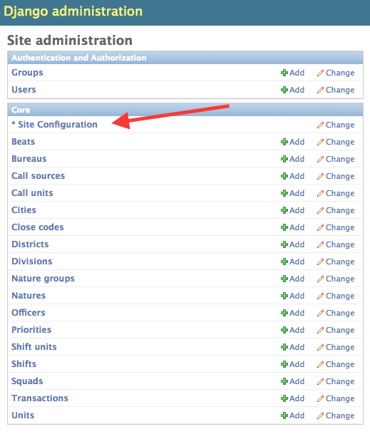
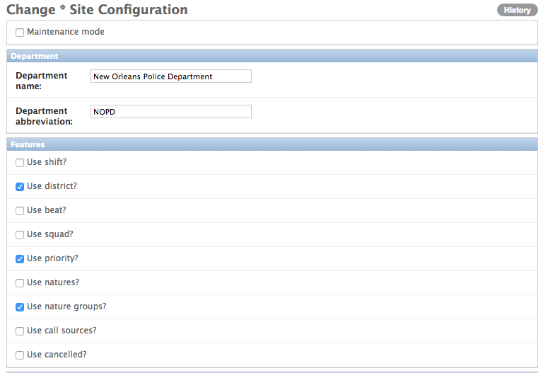
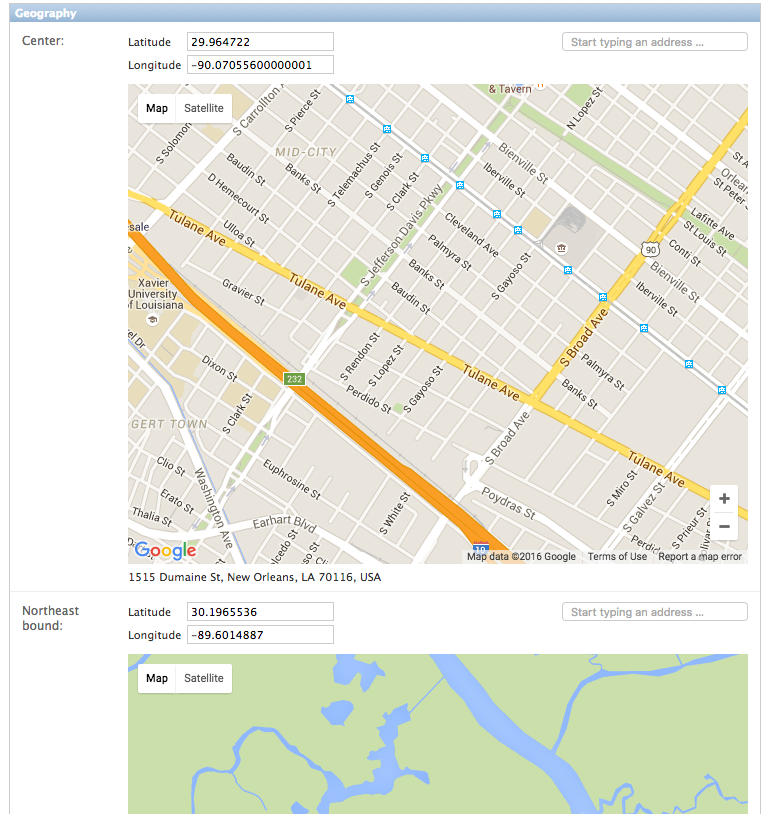

# Configuration

CFS Analytics must be configured before use. To configure the application,
go to http://localhost:8000/admin/ (or the admin URL for wherever you have
CFS Analytics installed) and click "Site Configuration".

## Maintenance mode

While on, the site will show a maintenance page and not show any data. (This
feature is not yet implemented.)

## Features

This series of options enables both filters and charts. You can turn off a
particular type of data either if you do not have that data, or if you do
not wish to show that data.

## Geography

These options set up the maps for CFS Analytics. You will have to choose the
geographic center of the region you want to show, the northeast boundary, and
the southwest boundary. These are entered as longitude and latitude, but the
built-in Google Maps can help you select them.

**NOTE**: In order for these maps to appear, you will need to [get a Google Maps
API key](https://developers.google.com/maps/documentation/javascript/get-api-key).
The system will work just fine without getting a key, but will not show the maps
in site configuration. Once you have the key, you'll need to put it in
`cfs/settings/local.py` like so:

    GEOPOSITION_GOOGLE_MAPS_API_KEY = 'YOUR_API_KEY'

The default zoom level is how zoomed into the region your map should start. In
general, this should be 11 for a town or small city and 10 for a larger city. 